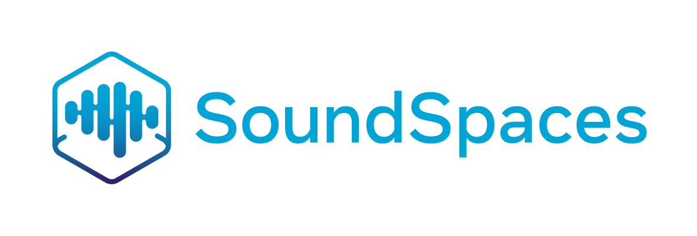

--------------------------------------------------------------------------------
SoundSpaces is a realistic acoustic simulation platform for audio-visual embodied AI research. From audio-visual navigation, audio-visual exploration to echolocation and audio-visual floor plan reconstruction, this platform expands embodied vision research to a broader scope of topics.

<p align="center"><a href="https://youtu.be/4uiptTUyq30">
  </a>
<br>
Click on the gif to view the video. Listen with headphones to hear the spatial sound properly!
</p>

[comment]: <> ([]&#40;https://youtu.be/4uiptTUyq30&#41;)
[comment]: <> (Presentation videos can be found at our [project page]&#40;http://vision.cs.utexas.edu/projects/audio_visual_navigation/&#41;.)

## Motivation
Moving around in the world is naturally a multisensory experience, but today's embodied agents are deaf---restricted to solely their visual perception of the environment. We introduce audio-visual navigation for complex, acoustically and visually realistic 3D environments. We further build *SoundSpaces*: a first-of-its-kind dataset of audio renderings based on geometrical acoustic simulations for two sets of publicly available 3D environments (Matterport3D and Replica), and we instrument [Habitat](https://github.com/facebookresearch/habitat-api/blob/master/README.md) to support the new sensor, making it possible to insert arbitrary sound sources in an array of real-world scanned environments.

## Citing SoundSpaces
If you use the SoundSpaces platform in your research, please cite the following [paper](https://arxiv.org/pdf/1912.11474.pdf):
```
@inproceedings{chen22soundspaces2,
  title     =     {SoundSpaces 2.0: A Simulation Platform for Visual-Acoustic Learning},
  author    =     {Changan Chen and Carl Schissler and Sanchit Garg and Philip Kobernik and Alexander Clegg and Paul Calamia and Dhruv Batra and Philip W Robinson and Kristen Grauman},
  booktitle =     {NeurIPS 2022 Datasets and Benchmarks Track},
  year      =     {2022}
}
@inproceedings{chen20soundspaces,
  title     =     {SoundSpaces: Audio-Visual Navigaton in 3D Environments},
  author    =     {Changan Chen and Unnat Jain and Carl Schissler and Sebastia Vicenc Amengual Gari and Ziad Al-Halah and Vamsi Krishna Ithapu and Philip Robinson and Kristen Grauman},
  booktitle =     {ECCV},
  year      =     {2020}
}
```
If you use any of the 3D scene assets (Matterport3D, Replica, HM3D, Gibson, etc.), please make sure you cite these papers as well!

## Installation 
Follow the [step-by-step installation guide](INSTALLATION.md) to install the repo.

## Usage
This repo renders audio-visual observations with high acoustic and spatial correspondence. 
It supports various visual-acoustic learning tasks, including audio-visual embodied navigation, acoustics prediction from egocentric observations, etc.
In this repo, we provide code for training and evaluating audio-visual navigation agents. 
For other downstream tasks, please check out each paper's respective repo, 
e.g., [visual acoustic matching](https://github.com/facebookresearch/visual-acoustic-matching) 
and [audio-visual dereverberation](https://github.com/facebookresearch/learning-audio-visual-dereverberation).

Below we show some example commands for training and evaluating AudioGoal with depth sensor on Replica. 
1. Training
```
python ss_baselines/av_nav/run.py --exp-config ss_baselines/av_nav/config/audionav/replica/train_telephone/audiogoal_depth.yaml --model-dir data/models/replica/audiogoal_depth
```
2. Validation (evaluate each checkpoint and generate a validation curve)
```
python ss_baselines/av_nav/run.py --run-type eval --exp-config ss_baselines/av_nav/config/audionav/replica/val_telephone/audiogoal_depth.yaml --model-dir data/models/replica/audiogoal_depth
```
3. Test the best validation checkpoint based on validation curve
```
python ss_baselines/av_nav/run.py --run-type eval --exp-config ss_baselines/av_nav/config/audionav/replica/test_telephone/audiogoal_depth.yaml --model-dir data/models/replica/audiogoal_depth EVAL_CKPT_PATH_DIR data/models/replica/audiogoal_depth/data/ckpt.XXX.pth
```
4. Generate demo video with audio
```
python ss_baselines/av_nav/run.py --run-type eval --exp-config ss_baselines/av_nav/config/audionav/replica/test_telephone/audiogoal_depth.yaml --model-dir data/models/replica/audiogoal_depth EVAL_CKPT_PATH_DIR data/models/replica/audiogoal_depth/data/ckpt.220.pth VIDEO_OPTION [\"disk\"] TASK_CONFIG.SIMULATOR.USE_RENDERED_OBSERVATIONS False TASK_CONFIG.TASK.SENSORS [\"POINTGOAL_WITH_GPS_COMPASS_SENSOR\",\"SPECTROGRAM_SENSOR\",\"AUDIOGOAL_SENSOR\"] SENSORS [\"RGB_SENSOR\",\"DEPTH_SENSOR\"] EXTRA_RGB True TASK_CONFIG.SIMULATOR.CONTINUOUS_VIEW_CHANGE True DISPLAY_RESOLUTION 512 TEST_EPISODE_COUNT 1
```
5. Interactive demo
```
python scripts/interactive_demo.py
```
5. ***[New]*** Training continuous navigation agent 
```
python ss_baselines/av_nav/run.py --exp-config ss_baselines/av_nav/config/audionav/mp3d/train_telephone/audiogoal_depth_ddppo.yaml --model-dir data/models/ss2/mp3d/dav_nav CONTINUOUS True
```

## SoundSpaces 1.0
We provide acoustically realistic audio renderings for Replica and Matterport3D datasets. 
The audio renderings exist in the form of pre-rendered room impulse responses (RIR), which allows 
users to convolve with any source sounds they wish during training. 
See [dataset](soundspaces/README.md) for more details.  
Note that we do not open source the rendering code at this time.

## SoundSpaces 2.0
SoundSpaces 2.0 is a fast, continuous, configurable and generalizable audio-visual simulation platform that allows
users to render sounds for arbitrary spaces and environments. 
As a result of rendering accuracy improvements, the rendered IRs are different from SoundSpaces 1.0.
Check out the [jupyter notebook](examples/soundspaces2_quick_tutorial.ipynb) for a quick tutorial. The documentation of the APIs can be found [here](SoundSpaces2.md).

## Contributing
See the [CONTRIBUTING](CONTRIBUTING.md) file for how to help out.

## License
SoundSpaces is CC-BY-4.0 licensed, as found in the [LICENSE](LICENSE) file.

The trained models and the task datasets are considered data derived from the correspondent scene datasets.
- Matterport3D based task datasets and trained models are distributed with [Matterport3D Terms of Use](http://kaldir.vc.in.tum.de/matterport/MP_TOS.pdf) and under [CC BY-NC-SA 3.0 US license](https://creativecommons.org/licenses/by-nc-sa/3.0/us/).
- Replica based task datasets, the code for generating such datasets, and trained models are under [Replica license](https://github.com/facebookresearch/Replica-Dataset/blob/master/LICENSE).

## Omni-Long Notes

### Ordered mode

- The agent must find multiple goals in a fixed order.
- If a task contains `N` goals, the agent can only issue `N-1` `submit` actions. The `N`-th `submit` is treated as `stop`.
- Every `submit` or `stop` receives environment feedback indicating whether the current target is found.
- We also use shaped rewards and they can be redefined as needed:
  - each time step gives `-0.1`
  - `submit` and `stop` receive a large penalty to discourage random submission
  - decreasing geodesic distance gives positive reward, increasing distance gives negative reward
  - finding a goal gives a large positive reward
- A goal is considered found when:
  - the Euclidean distance between the agent sensor and the goal surface is less than `1m`
  - the goal also appears in the semantic sensor

### Unordered mode

- The agent can find multiple goals in any order.
- If a task contains `N` goals, the agent can only issue `N-1` `submit` actions. The `N`-th `submit` is treated as `stop`.
- On each `submit`, the environment checks whether there exists any goal within `1m` of the agent.
- If such a nearby goal exists, the environment further checks whether that goal is also visible in the semantic sensor.

### Evaluation modes

#### Single-process mode

This is mainly used by oracle baselines. Since the policy needs to call the environment shortest-path API internally, the policy and environment cannot be separated.

```bash
python scripts/omni_long_eval.py \
  --policy oracle_shortest_submit \
  --eval-config configs/omni-long/mp3d/eval_omni-long.yaml
```

#### Split env / policy mode

In this mode, the environment and the policy run as two local processes.

1. Start the environment server:

```bash
python scripts/env_server.py \
  --eval-config configs/omni-long/mp3d/eval_omni-long.yaml \
  --bind tcp://*:5555
```

2. Start the policy client:

```bash
python scripts/policy_client.py \
  --connect tcp://127.0.0.1:5555 \
  --policy omega_nav \
  --policy-kwargs '{"config_path":"ss_baselines/omega_nav/configs/perception.yaml"}' \
  --video
```

### How to extend baselines

#### RL-based baselines

- If you need online BC-assisted training, it is more suitable to use the single-process mode.
- You can add new RL baselines under `ss_baselines` and follow the existing Omni-Long training pipeline.
- A useful reference script is `scripts/train_omni_long_mp3d_bc.sh`.

#### Module-based baselines

- Prefer evaluation directly on the validation split without extra training when possible.
- A good reference implementation is `ss_baselines/omega_nav`.
- In particular, the main logic lives in `OmegaNavPolicy`, especially its `act` and `observe` functions in `ss_baselines/omega_nav/policy.py`.

### TODO

1. Add two RL baselines, referencing GOAT and SAVI / ENMuS:
   - one baseline without audio, similar to GOAT
   - one baseline without text / image, similar to SAVI or ENMuS
2. Add two module-based baselines:
   - one GOAT-style baseline without audio
   - one baseline without text / image; this may need a custom design. The RILA paper can be used as a reference: [RILA: Reflective and Imaginative Language Agent for Zero-Shot Semantic Audio-Visual Navigation](https://openaccess.thecvf.com/content/CVPR2024/papers/Yang_RILA_Reflective_and_Imaginative_Language_Agent_for_Zero-Shot_Semantic_Audio-Visual_CVPR_2024_paper.pdf)
